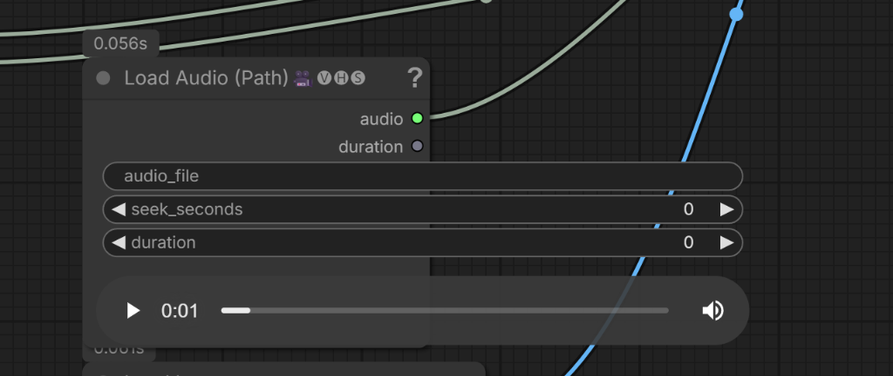

# 🛡️ ComfyUI Node Layout Guard

[](https://github.com/comfyanonymous/ComfyUI)
[](LICENSE)
[](#)

A lightweight, non-destructive frontend Quality-of-Life (QoL) extension for **ComfyUI** that fixes and prevents visual layout glitches, unresponsive DOM widgets (audio/video players), and input overflow when manually resizing nodes.

---

[🇺🇸 English](#english-documentation) | [🇸🇦 العربية](#-التوثيق-باللغة-العربية)

---

## 🇺🇸 English Documentation

### 🎯 The Problem
In ComfyUI, when manually resizing nodes on the canvas, the outer bounding box resizes, but the internal widgets and inputs often remain frozen at fixed pixel widths. This issue impacts **both core/official ComfyUI nodes and third-party custom nodes alike** (frequently triggered when custom node extensions modify global canvas rendering prototypes, or when nodes embed HTML DOM elements like audio/video players, text areas, and dynamic widgets).



This causes:
* Media players (`<audio>`, `<video>`), text boxes, and input fields sticking out or overflowing outside the node boundaries.
* Core and custom nodes alike suffering from frozen widget widths and visual misalignment upon resizing.
* Broken UI proportions and layout distortion when organizing complex workflows.

### ✨ Solution & Key Features
`ComfyUI-Node-Layout-Guard` acts as an automatic, transparent synchronization layer for the Canvas:
1. **Real-Time DOM & Widget Synchronization:** Dynamically recalculates and updates `style.width` for all DOM elements (`<audio>`, `<video>`, `<input>`, `<textarea>`) and custom widgets in real-time as you drag the resize handle.
2. **Non-Destructive Chaining:** Safely wraps LiteGraph prototype and node-level events (`onResize`, `onConnectionsChange`, `onConfigure`) without overriding or breaking existing node logic.
3. **One-Click Auto-Fit Action:** Adds a handy context menu option (`Right-Click Node -> 📐 Auto-Fit & Fix Layout`) to restore ideal node dimensions instantly.
4. **Zero Overhead:** 100% pure client-side JavaScript. Zero Python dependencies, zero VRAM usage, and zero impact on AI model execution.
5. **Universal Compatibility:** Works seamlessly across modern ComfyUI versions (0.31+) and handles all core and custom node packages out-of-the-box.

---

### 📦 Installation

#### Option 1: Via Git (Recommended)
Open a terminal in your `ComfyUI/custom_nodes/` directory and run:
```bash
git clone https://github.com/X-BA-1/ComfyUI-Node-Layout-Guard.git
```
Then **Restart ComfyUI**.

#### Option 2: Manual Download
1. Download this repository as a ZIP archive.
2. Extract the folder into `ComfyUI/custom_nodes/ComfyUI-Node-Layout-Guard`.
3. **Restart ComfyUI**.

---

### 🎮 Usage
* **Automatic:** Just drag to resize any node on your canvas. Audio players, video previews, and widgets will automatically scale and fit neatly inside the node.
* **Context Menu:** Right-click any node and select **`📐 Auto-Fit & Fix Layout`** whenever you want to reset its size cleanly.
* **Settings:** Toggle the extension on/off anytime from `ComfyUI Settings -> Extension -> Custom -> Comfy.NodeLayoutGuard`.

---

<br/>

---

## 🇸🇦 التوثيق باللغة العربية

### 🎯 المشكلة التي تحلها الإضافة
في واجهة ComfyUI، عند محاولة تكبير أو تصغير حجم أي عقدة يدوياً بالسحب، يتغير حجم الإطار الخارجي فقط بينما تظل عناصر الإدخال والـ Widgets محتفظة بعرض بكسل ثابت. هذه المشكلة تصيب **كلاً من العقد الرسمية التابعة لـ ComfyUI والعقد المخصصة على حد سواء** (نتيجة لقيام بعض الإضافات المخصصة باعتراض وتعديل دوال الرسم العامة للـ Canvas، أو عند احتواء العقد على عناصر HTML مركبة مثل مشغلات الصوت والفيديو وحقول النصوص).


يؤدي ذلك إلى:
* بروز عناصر الإدخال ومشغلات الوسائط (`<audio>`, `<video>`) وحقول النصوص خارج حدود العقدة بشكل مشوه.
* تجمد عرض الـ Widgets في العقد الرسمية والمخصصة وعدم تجاوبها مع التحجيم اليدوي أثناء ترتيب وتنسيق مسارات العمل.

---

### 🌟 المميزات والحلول الهندسية
تقوم إضافة **ComfyUI-Node-Layout-Guard** بحل هذه المشكلة تلقائياً عبر:
1. **المزامنة اللحظية لعناصر الـ DOM والـ Widgets:** تحديث فوري وتلقائي لأبعاد كافة عناصر HTML (مشغلات الصوت، مشغلات الفيديو، ومربعات النصوص) أثناء سحب وتحجيم العقدة لتظل متطابقة ومحتواة بالكامل داخل الإطار.
2. **أمان تام وتوافقية عالية (Non-Destructive):** تستدعي الدوال الأصلية للعقد دون حذف أو تعطيل أي ميزة من ميزات العقد الأخرى.
3. **أداة الإصلاح السريع بنقرة واحدة (Context Menu):** خيار مباشر في قائمة الزر الأيمن لأي عقدة (`📐 Auto-Fit & Fix Layout`) لإعادة ضبط واحتواء أبعاد العقدة بضغطة زر.
4. **خفة مطلقة (Zero Performance Overhead):** تعمل بالكامل داخل المتصفح بجافاسكربت نقي، دون أي استهلاك للذاكرة (VRAM/RAM) أو تأثير على سرعة التوليد.
5. **توافق شامل:** متوافقة مع إصدارات ComfyUI الحديثة (0.31+ فما فوق) وتعمل تلقائياً مع كافة العقد الرسمية والمخصصة.

---

### 📥 طريقة التثبيت

1. ضع مجلد `ComfyUI-Node-Layout-Guard` داخل مسار `custom_nodes` لديك (أو عبر `git clone`).
2. **أعد تشغيل ComfyUI (Restart ComfyUI)**.
3. ستعمل الإضافة تلقائياً، ويمكنك التحكم بتشغيلها أو إيقافها من إعدادات الواجهة:
   `Settings -> Extension -> Custom -> Comfy.NodeLayoutGuard`.

---

## 📄 License
This project is licensed under the **MIT License**.
